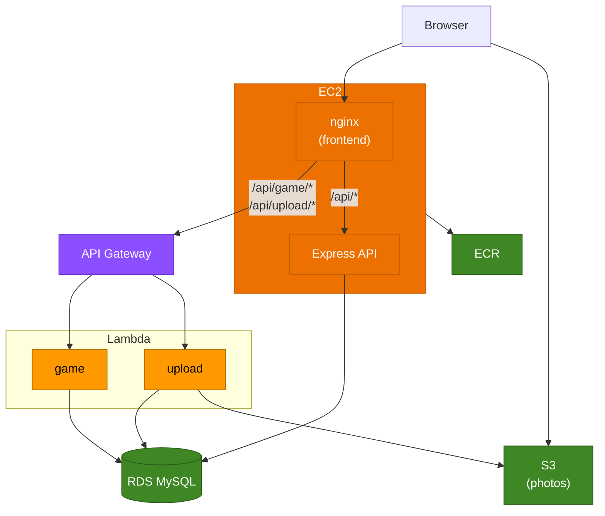

# KFUPM GeoGuesser — Architecture Diagram

## Request Flow

| Path | Route |
|------|-------|
| `GET /` (React app) | Browser → EC2 nginx → static files |
| `GET /api/game/random` | Browser → EC2 nginx → API Gateway → `game` Lambda → RDS |
| `POST /api/upload/presign` | Browser → EC2 nginx → API Gateway → `upload` Lambda → S3 |
| `GET /api/photos\|auth\|admins` | Browser → EC2 nginx → Express API :5000 → RDS |
| Image fetch | Browser → S3 direct (public URL) |

## Infrastructure Modules

| Module | Resources |
|--------|-----------|
| `networking` | VPC, 2 public subnets, IGW, route table |
| `security` | SG: EC2 (80/22 in), Lambda (egress only), RDS (3306 from EC2+Lambda) |
| `ecr` | 2 ECR repos (api, frontend) |
| `iam` | EC2 instance profile, Lambda VPC+S3 role, GitHub Actions OIDC role |
| `rds` | RDS MySQL t3.micro, subnet group |
| `lambda` | game + upload Lambdas, API Gateway HTTP API, S3 CORS config |
| `ec2` | t3.micro, Elastic IP, user-data bootstrap |
